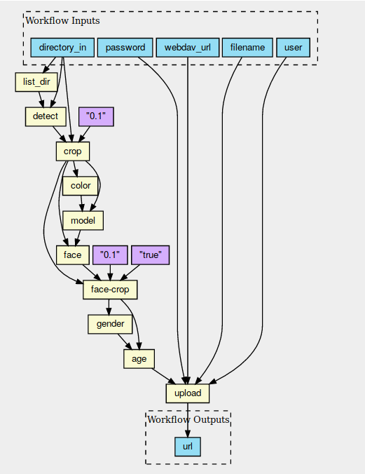

# deeplearning
Deep learning topic in Sherlock 

*Note:* This repo doesn't contain the usecases datasets. They are stored at an external drive and while testing they could be copied to local Datasets directory with usecases AdienceFaces and CompCars.

The CWL image understanding workflow is visualized 

The input of the workflow is an image, and the output of the workflow is a json document describing the content of the image.
